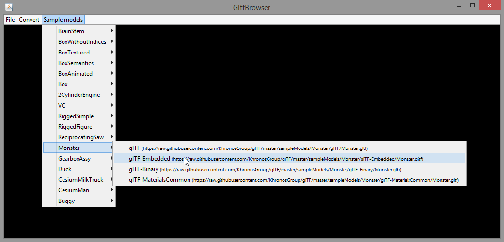
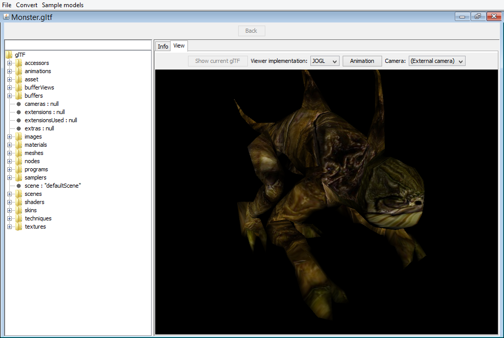
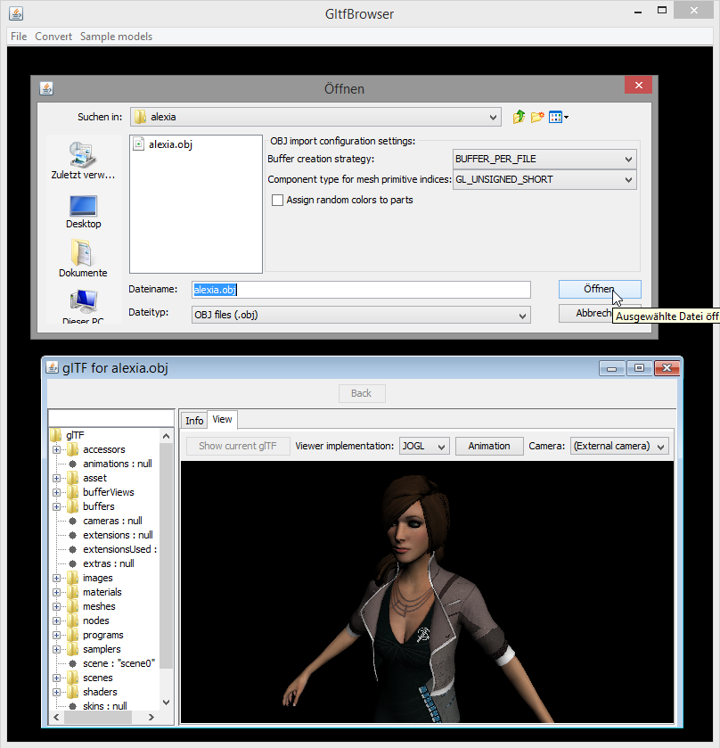
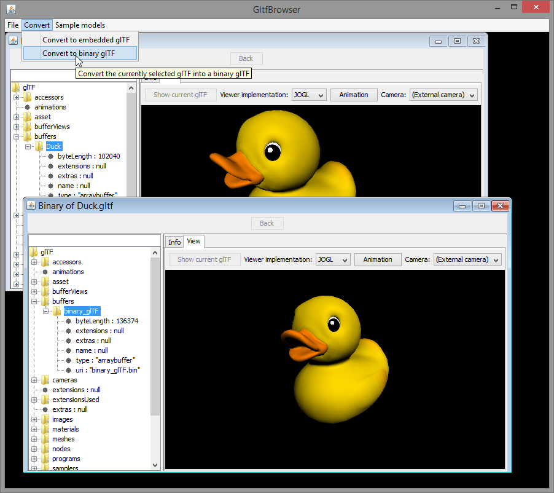
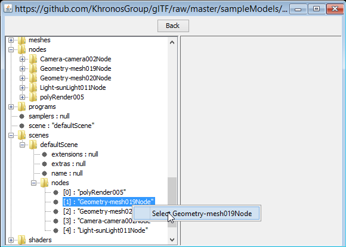
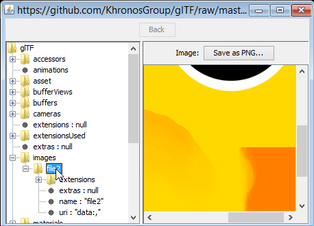
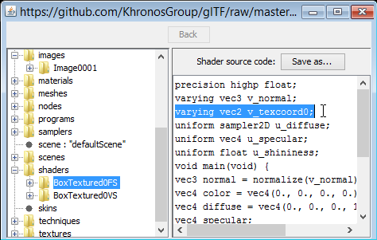
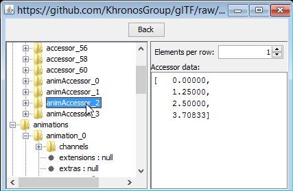

# jgltf-browser - A Java glTF browser 

A utility for loading, viewing, creating, browsing and converting 
[glTF](https://github.com/KhronosGroup/glTF/) data.

**Note:** This application is still subject to change.

After building and installing the JglTF libraries with

    mvn clean install

from the main `JglTF` directory, change into the `jgltf-browser` directory and call

    mvn clean compile assembly:single
    
to create the standalone browser application (with all dependencies)

An overview of the current functionality:

* Drag-and-drop glTF links or files into the browser window

* Directly load sample models from the repository 

* Viewing the models 

* Importing OBJ files 

* Converting to embedded- or binary glTF 

* Basic browsing by right-clicking references and selecting the referenced
element:
 

* Viewing images (of textures):

* Viewing the source code of vertex- and fragment shaders:

* Viewing the data that is provided by accessors:

